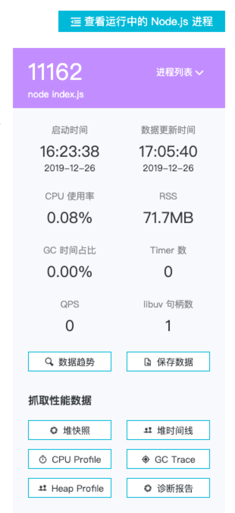
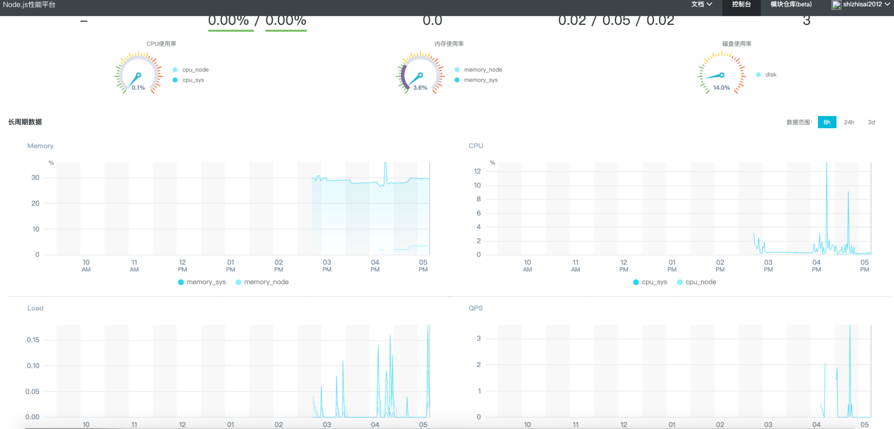

# 二、内存控制

## 内存分配
Js中的对象都是保存在堆中的，当声明对象并赋值的时候，就会占用已申请的空闲空间，当空闲空间大小不够时就会继续申请空间，直到超出v8的限制。

## v8的垃圾回收机制
v8中的堆内存分为两块，新生代内存和老生代内存。新生代内存保存在内存中存活时间较短的对象，老生代内存保存在内存中存活时间较长或者常驻内存的对象。

### Scavenge 算法（新生代内存）

原理：新生代中对象主要依靠Scavenge算法进行垃圾回收，该算法先将堆内存空间一分为二，一半处于闲置状态，一半处于使用状态，分别叫做To空间和From空间。在进行垃圾回收时，会将From空间的存活对象复制到To空间内，非存活对象占用的空间就会被释放。完成复制后，两个空间的角色发生互换。

缺点：内存只能利用一半，典型的空间换时间的做法。

当一个对象经过多次复制依然存活时，就会从新生代空间转移到老生代空间，这种方式被称为晋升。

对象晋升的条件，一是该对象是否经历过Scavenge算法的回收，二是对象To空间的内存占用比超过限制（25%）。

### 标记清除和标记整理（老生代内存）

老生代内存中存活对象占较大比重，如果还是采用Scavenge算法复制存活的对象效率较低，同时还要浪费一半的内存空间。

标记清除原理：标记清除在在标记阶段会遍历所有的对象，但是只会标记活着的对象，在标记清除阶段会清除没有被标记的对象。与Scavenge不同的是，标记清除只会清除没有被标记的对象。

缺点：进行一次标记清除会出现内存不连续的情况，无法保存一个大内存对象。

标记整理原理：在标记对象死亡后，将活着的对象向内存一端移动，移动完成后直接清除掉边界外的内存。

### 增量标记
以上三种垃圾回收算法都要暂停Js的执行逻辑，新生代存活对象较少，即使是全停顿也影响不大。老生代采用增量标记的策略，将标记拆分为很多步，每做完一次标记就让Js逻辑执行一会，直到标记完成。

## Node查看内存占用

### Node 自带 profile

* 第一步：以 --prof 命令启动Node

```
  node --prof index.js
```
* 第二步：处理生成的log文件
  
```
  node --prof-process isolate-0XXXXXXXXXXX-v8-XXXX.log > profile.txt
```
* 分析 profile.txt

### 使用heapdump

* 第一步: 安装 node-heapdump

```
  npm install heapdump

```

* 第二步: 在代码中应用 node-headdump

```
  var heapdump = require('heapdump');
  heapdump.writeSnapshot(function(err, filename) {
    console.log('dump written to', filename);
  });
```

* 第三步: 启动应用

```
  node app.js
```

* 第四步： 生成快照

```
  kill -USR2 <pid>
```

### 使用alinode
阿里自研强大的Node监控云平台，Ubuntu16.04搭建步骤：

第一步：安装tnvm（淘宝的node版本管理工具）
```
  bash -c "$(curl -fsSL https://raw.githubusercontent.com/aliyun-node/tnvm/master/install.sh)"
```
如果遇到 403 forbidden，就将https变成http。

第二步：加入到全局变量

```
  source ~/.bashrc
```
第三步：查看需要安装的alinode版本
```
  tnvm ls-remote alinode
```
第四步：选择版本安装
```
  tnvm install alinode-v5.9.0
```
第五步：使用alinode
```
  tnvm use linode-v5.9.0
```
第六步：安装 agenthub
```
npm install @alicloud/agenthub -g
```
第七步：创建实例

登录 https://node.console.aliyun.com，如果没有账号，可以免费创建。创建实例并将下图的appId和appSecret保存到config.json里。


```
  // config.json
  {
    
    "appid": "83229",
    "secret": "7d5280223cf8a47e1e3450ee461aaafa9e71021b"
  }
```
第八步：将config.json移动到项目根目录下

第九步：开启上报工具
```
  agenthub start alinode.config.json 
```

第十步：启动应用
```
  // 直接启动
  ENABLE_NODE_LOG=YES node app.js 
  // 或者PM2 启动
  ENABLE_NODE_LOG=YES pm2 start pm2.js 
  // 或者其他任何方式，但要加上 ENABLE_NODE_LOG=YES 开启日志。
```
第十一步：查看监控数据




