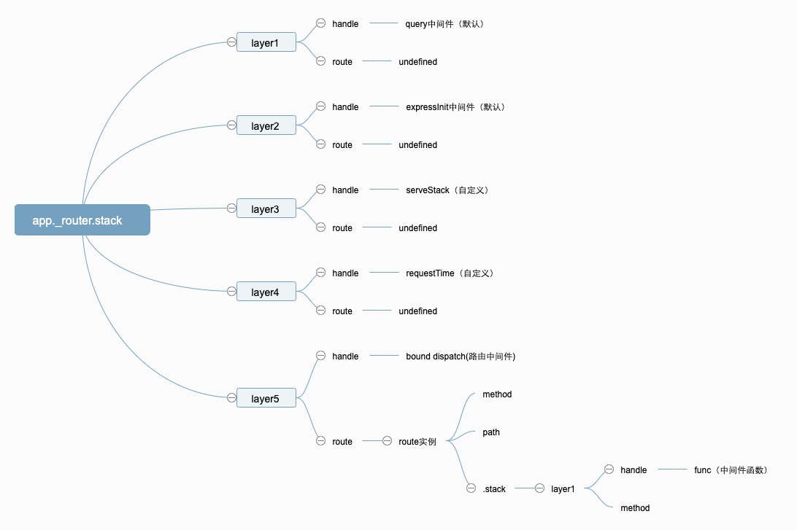
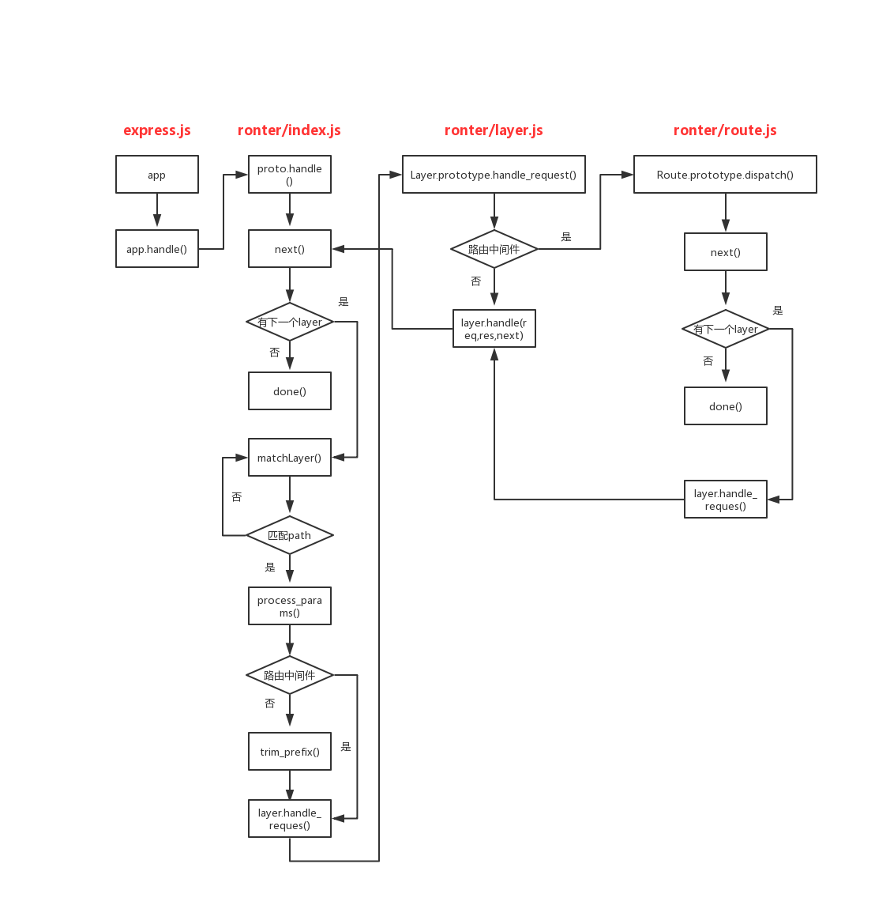

# 二、Express中间件

## 中间件是什么

中间件是在Express请求和相应周期中可以访问请求和相应对象以及下一个中间件的函数。调用next()函数将在该中间件之后下一个执行中间件。

中间件可以执行以下的功能：
    
  * 执行任何代码
  * 更改请求和相应对象
  * 结束请求-响应周期
  * 调用堆栈中的下一个中间件

如果当前中间件没有结束请求-相应周期，则必须调用next()将控制权传递给下一个中间件功能，否则，该请求将被挂起。

中间件加载的顺序很重要，首先加载的中间件功能也将首先执行。

一个简单的例子：
```
  var express = require('express')
  var app = express()

  var requestTime = function (req, res, next) {
    req.requestTime = Date.now()
    next()
  }

  app.use(requestTime)

  app.get('/', function (req, res) {
    var responseText = 'Hello World!<br>'
    responseText += '<small>Requested at: ' + req.requestTime + '</small>'
    res.send(responseText)
  })

  app.listen(3000)
```
在这个例子里 requestTime 就是一个中间件，在这个例子中，该中间件给req挂载了 requestTime 属性
执行next()方法，把中间件的控制权交给 app.get() 
## 中间件类型

### 应用级中间件

通过app.use()函数，挂载到app实例上。

```
  // 每次发送请求会打印
  app.use(function (req, res, next) {
    console.log('Time:', Date.now())
    next()
  })
  // 访问/login路径的时候会打印，不管发送什么请求
  app.use('/login',function (req, res, next) {
    console.log('Time:', Date.now())
    next()
  })
  // 发送get请求且路径为 /login的时候会打印
  app.get('/login',function (req, res, next) {
    console.log('Time:', Date.now())
    next()
  })
```

### 路由中间件

通过app.method()函数，挂载到app实例上。

```
  // 发送get请求且路径为 /login的时候会打印
  app.get('/login',function (req, res, next) {
    console.log('Time:', Date.now())
    next()
  })
  // 发送post请求的时候执行相应回调
  app.post('/login', fuunction(req, res, next) {
    console.log('Time:', Date.now())
    next()
  })
```

### 错误处理中间件

中间件传递四个参数
```
app.use(function (err, req, res, next) {
  console.error(err.stack)
  res.status(500).send('Something broke!')
})
```

### 内置中间件
express.static() | express.json() | express.urlencoded() | express.Router() 
```
  app.use(express.static('dist'))
```

### 第三方中间件

```
  var express = require('express')
  var app = express()
  var cookieParser = require('cookie-parser')

  // load the cookie-parsing middleware
  app.use(cookieParser())
```

## 中间件原理

中间件的核心要搞懂app.use() && app.method() 到底做了什么。在构造函数一节中，app继承自 proto， proto定义在 /lib/application.js 文件下。该文件定义了所有挂载到app实例上的方法，比如app.method() || app.use() || app.listen()

### app.use()
application.js line 199行有该函数的定义：
```
  app.use = function use(fn) {
    // 确定取函数参数的位置
    var offset = 0;
    var path = '/';

    // default path to '/'
    // disambiguate app.use([fn])
    // 兼容两种模式 app.use([fn])
    if (typeof fn !== 'function') {
      var arg = fn;

      while (Array.isArray(arg) && arg.length !== 0) {
        arg = arg[0];
      }

      // first arg is the path
      if (typeof arg !== 'function') {
        offset = 1;
        path = fn;
      }
    }
    // 获取所有的中间件函数，如果有path的话，从第二位参数往后拿到所有函数，否则从第一个往后拿到所有函数
    var fns = flatten(slice.call(arguments, offset));

    if (fns.length === 0) {
      throw new TypeError('app.use() requires a middleware function')
    }
    ...
  }
```
这一部分代码是对app.use()函数的参数处理部分，从代码可以看出，app.use()其实也支持app.use([path, fn])这样的传参，这里定义了一个offset变量以便于在有无path的情况下均能正确拿到所有的中间件函数。slice指向的是 Array.prototype.slice。flatten是对目标的深拷贝。这段代码最后拿到了 fns，一个由中间件函数组成的数组。

application.js line 228 初始化路由参数
```
  this.lazyrouter();
```
application.js line 146 

```
  app.lazyrouter = function lazyrouter() {
    // 初始化router实例并挂载到this._router上
    if (!this._router) {
      this._router = new Router({
        caseSensitive: this.enabled('case sensitive routing'),
        strict: this.enabled('strict routing')
      });

      this._router.use(query(this.get('query parser fn')));
      this._router.use(middleware.init(this));
    }
  };
```
初始化router的时候传入了两个默认的中间件，这两个中间件没有任何path,代表任何路径都会匹配到，query()和middleware()这两个中间件的作用是什么呢？

/lib/middleware/query.js
```
  module.exports = function query(options) {
    var opts = merge({}, options)
    // qs.parse => key=value => {key: value}
    var queryparse = qs.parse;
    
    // options可以传function，此时 queryparse 为qs.parse(str, { allowPrototype: true});
    if (typeof options === 'function') {
      queryparse = options;
      opts = undefined;
    }
    // 不是函数的话手动设置opts.allowPrototypes 为true
    if (opts !== undefined && opts.allowPrototypes === undefined) {
      // back-compat for qs module
      opts.allowPrototypes = true;
    }

    return function query(req, res, next){
      if (!req.query) {
        // req.query => Object的类型
        var val = parseUrl(req).query;
        req.query = queryparse(val, opts);
      }

      next();
    };
  };
```

由以上代码可以看出query()中间件的作用是将请求的url参数比如：/path?id=2 转化成{id: 2}，并挂载到req.query属性上。转化用了 qs.parse()方法。

/lib/middleware/init.js line28

```
  exports.init = function(app){
    return function expressInit(req, res, next){
      if (app.enabled('x-powered-by')) res.setHeader('X-Powered-By', 'Express');
      req.res = res;
      res.req = req;
      req.next = next;

      setPrototypeOf(req, app.request)
      setPrototypeOf(res, app.response)

      res.locals = res.locals || Object.create(null);

      next();
    };
  };
```
middleware.init(this) 初始化中间件，设置响应头 X-Powered-By 为express，将res挂载到req上，req挂载到res上。（这样做的目的是什么？）。

application.js line 228 - 237

```
  app.use = function use(fn) {
    ...
    this.lazyrouter();
    var router = this._router;

    fns.forEach(function (fn) {
      // non-express app
      if (!fn || !fn.handle || !fn.set) {
        // 执行 router 的use方法
        return router.use(path, fn);
      }
    }
    ... 
  }
```
拿到fns也就是所有中间件函数组成的数组后，它会逐个遍历，然后判断fn是否有handle属性和set属性，如果有的话，就默认是express app，否则就是非express app，如果不是express app，那么就将path，和fn传入到router.use()里。router就是之前刚刚初始化的router实例。（假如一个自定义中间件有handle和set属性也是自定义的，它是不是也就走到express app分支里了？），这里的关键是router.use()方法。

/lib/router/index.js line 43 - 60

```
  var proto = module.exports = function(options) {
    var opts = options || {};

    function router(req, res, next) {
      router.handle(req, res, next);
    }

    // mixin Router class functions
    setPrototypeOf(router, proto)

    router.params = {};
    router._params = [];
    router.caseSensitive = opts.caseSensitive;
    router.mergeParams = opts.mergeParams;
    router.strict = opts.strict;
    router.stack = [];

    return router;
  };
```
router的构造函数，new Router() 之后返回一个router对象，这个对象挂载了一系列属性，比较重要的是stack属性，用来存layer的。

/lib/router/index.js line 454 - 475

```
  proto.use = function use(fn) {
    ...

    for (var i = 0; i < callbacks.length; i++) {
      var fn = callbacks[i];

      if (typeof fn !== 'function') {
        throw new TypeError('Router.use() requires a middleware function but got a ' + gettype(fn))
      }

      // add the middleware
      debug('use %o %s', path, fn.name || '<anonymous>')
      // 创建layer
      var layer = new Layer(path, {
        sensitive: this.caseSensitive,
        strict: false,
        end: false
      }, fn);
      // 如果是普通中间件 layer.route 置为undefined
      layer.route = undefined;
      // 将layer保存到router.stack里
      this.stack.push(layer);
    }
    return this;
  };
```
router.use()前半部分也是参数处理，和app.use()一样，最后拿到callbacks也就是中间件函数数组，遍历之后针对每一个fn创建一个layer对象，并把layer对象保存到router.stack里，该stack是在构造函数里定义的。

/lib/router/layer.js

该文件定义了layer的构造函数，错误中间件 | 普通中间件的处理，以及layer的匹配方法。

### app.method()
app.method() 也就是app.get() | app.post() 等方法的总称。

/lib/application.js line 490 - 502

```
  methods.forEach(function(method){
    app[method] = function(path){
      if (method === 'get' && arguments.length === 1) {
        // app.get(setting)
        return this.set(path);
      }

      this.lazyrouter();

      var route = this._router.route(path);
      route[method].apply(route, slice.call(arguments, 1));
      return this;
    };
});
```
这段代码主要是创建route实例，然后执行相应的route[method]方法。我们看下router.route()方法做了什么。

/lib/router/index.js line 491 - 504
```
  proto.route = function route(path) {
    var route = new Route(path);
    // 创建layer对象
    var layer = new Layer(path, {
      sensitive: this.caseSensitive,
      strict: this.strict,
      end: true
    }, route.dispatch.bind(route));

    // layer.route 属性置为route
    layer.route = route;
    // layer 放到stack里
    this.stack.push(layer);
    return route;
  };
```
router.route 会先创建一个 route 对象，然后再创建一个 layer，layer 的 route 属性指向 route 对象，这一点和app.use()不同，然后也是将layer放到router.stack数组里。

/lib/router/route.js line 43 - 51

```
  function Route(path) {
    this.path = path;
    this.stack = [];

    debug('new %o', path)

    // route handlers for various http methods
    this.methods = {};
  }
```
route实例的构造函数，route实例有三个属性，path通过 router.route(path) 传递进来，stack不同于router中的stack，methods是干啥的？

route.js line 192 - 216
```
  methods.forEach(function(method){ 
    Route.prototype[method] = function(){
      var handles = flatten(slice.call(arguments));

      for (var i = 0; i < handles.length; i++) {
        var handle = handles[i];

        if (typeof handle !== 'function') {
          var type = toString.call(handle);
          var msg = 'Route.' + method + '() requires a callback function but got a ' + type
          throw new Error(msg);
        }

        debug('%s %o', method, this.path)

        var layer = Layer('/', {}, handle);
        layer.method = method;

        this.methods[method] = true;
        this.stack.push(layer);
      }

      return this;
    };
  });
```
在route里执行相应的Method方法，其实也创建一个layer，每一个layer对应一个中间件函数，最后push到route.stack里。

### 梳理


```
  var requestTime = function (req, res, next) {
    req.requestTime = Date.now()
    next()
  }
  app.use(express.static('dist'))

  app.use(requestTime)

  app.post('/helo', function (req, res) {
    console.log(req.query)
    var responseText = 'Hello World!<br>'
    responseText += '<small>Requested at: ' + req.requestTime + '</small>'
    res.send(responseText)
  })

  
  app.listen(3000)
```
在这里例子中用了三个中间件，加上初始化两个中间件，一共五个中间件。示例图如下：



<p style="text-align: center">中间件示例图</p>

### 匹配

中间件函数被存到layer里，那么这些中间件函数是如何触发的呢？

appliction.js 634 - 637

```
  app.listen = function listen() {
    var server = http.createServer(this);
    return server.listen.apply(server, arguments);
  };
```
app实例作为 http.createServer 的回调，每次有请求进来都会执行 app()。

express.js 37 - 40
```
function createApplication() {
  var app = function(req, res, next) {
    app.handle(req, res, next);
  };
}
```
app也是一个函数，执行app(req, res, next) 也就是执行app.handle()

appliction.js 168 - 185

```
  app.handle = function handle(req, res, callback) {
    var router = this._router;

    // final handler
    var done = callback || finalhandler(req, res, {
      env: this.get('env'),
      onerror: logerror.bind(this)
    });

    // no routes
    if (!router) {
      debug('no routes defined on app');
      done();
      return;
    }

    router.handle(req, res, done);
  };
```

app.handle 针对app上不存在_router的情况做了特殊处理，最后调用了app._router.handle。

/lib/router/index.js line 219 - 257

```
proto.handle = function handle(req, res, out) {
  ...
  var layer;
  var match;
  var route;
  while (match !== true && idx < stack.length) {
    layer = stack[idx++];
    match = matchLayer(layer, path);
    route = layer.route;

    if (typeof match !== 'boolean') {
      // hold on to layerError
      layerError = layerError || match;
    }

    if (match !== true) {
      continue;
    }

    if (!route) {
      // process non-route handlers normally
      continue;
    }

    if (layerError) {
      // routes do not match with a pending error
      match = false;
      continue;
    }

    var method = req.method;
    var has_method = route._handles_method(method);

    // build up automatic options response
    if (!has_method && method === 'OPTIONS') {
      appendMethods(options, route._options());
    }

    // don't even bother matching route
    if (!has_method && method !== 'HEAD') {
      match = false;
      continue;
    }
  }
}
```
循环终止条件是匹配不到path，并且计数器大于_router.stack.length, 先调用 matchLayer 函数对 layer 和 path 进行匹配，matchLayer 实际上调用的是 Layer.prototype.match 方法，该方法通过挂载到layer.regexp上的正则和 path进行匹配，最后返回true或者false，匹配成功的话还会解析param挂载到layer.params上。

循环里主要处理路由中间件的情况，我们知道路由中间件的 layer.route 指向的是一个route实例，应用级别的中间件指向的是undefined，当是路由中间件的情况下，会调用 Route.prototype._handles_method() 方法，该方法的定义在 /lib/router/route.js里。该方法返回 true 或者 false，代表传入的参数是否是支持的 http 方法。如果 http 请求是options，它会将Express支持的请求方式转化成数组存放在options里。

/lib/router/index.js line 276 - 286 

```
  self.process_params(layer, paramcalled, req, res, function (err) {
    if (err) {
      return next(layerError || err);
    }

    if (route) {
      return layer.handle_request(req, res, next);
    }

    trim_prefix(layer, layerError, layerPath, path);
  });
```

路由匹配成功且为路由级别的中间件，执行 Layer.prototype.handle_request() 方法，否则调用trim_prefix() 标准化req.url | req.baseUrl，最后再调用 Layer.prototype.handle_request() 方法。

/lib/router/layer.js line 86 - 99

```
  Layer.prototype.handle_request = function handle(req, res, next) {
    var fn = this.handle;

    if (fn.length > 3) {
      // not a standard request handler
      return next();
    }

    try {
      fn(req, res, next);
    } catch (err) {
      next(err);
    }
} ;
```
如果参数大于三个跳过，否则执行layer.handle上挂载的中间件函数，执行完毕调用 next() 函数，将路由控制权交给下一个中间件。

### 总结



<p style="text-align: center">路由匹配</p>


