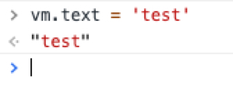
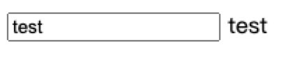
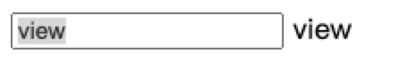
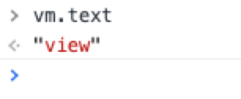

# 一、Vue.js

## 1、Vue.js 双向绑定原理

### 概述
::: tip
Vue 的双向绑定原理是通过 数据劫持 和 发布订阅模式来实现的。
:::

所谓双向绑定就是 数据（model） 的变化会引起视图（view）的改变。用户交互改变视图（view）也会引起数据 (model) 的改变。

#### Vue 双向绑定的小例子：

HTML：
```
  <div id="app">
    <input type="text" v-model="text">
    {{text}}
  </div>
```

Script:

```
  let vm = new Vue({
    el: '#app',
    data() {
      return {
        text: ''
      }
    }
  })
```

<b> 数据 =》 视图 </b>

控制台输入： vm.text = 'test'，展示如下：



页面变化如下：



<b> 视图 =》 数据 </b>

页面输入框输入：view

页面变化如下：



控制台查看 vm.text, 输出如下：



### 访问器属性之 defineProperty

前面提到 Vue 的双向绑定是通过数据劫持实现的，vue 的数据劫持就是通过 Object.defineProperty 来完成的，这也是 Vue 不支持低版本浏览器的原因。

Object.defineProperty() 可以劫持对象的赋值（set）或者取值（get）操作，使其按照我们预期的方式执行。当然它还有其他的作用，这里不谈。

Eg：

```
  let obj = { name: 'lili' }
  Object.defineProperty(obj, 'name', {
    set: function (val) {
      console.log(val)
      return this.name
    },
    get: function () {
      return '_get'
    }
  })
```

在控制台访问 obj.name 的时候会触发内部的 getter，从而返回的永远是 '_get'， setter 函数可以传参，该参数为设置的值。


### 一个简单的双向绑定小例子

有了 defineProperty 这个神器，我们就可以实现一个简单的双向绑定了。

视图 =》 数据：

监听 input 输入框事件，获取输入的 value 的值，然后改变数据的值。

数据 =》 视图：

利用 defineProperty 监听对应数据的 setter，然后改变视图。

eg:

HTML：

```
<div id="app">
  <input type="text" value="" />
  <span></span>
</div>
```

Script:

```
  let observeData = {}
  let span = document.querySelector('span')
  let input = document.querySelector('input')

  input.addEventListener('input',(e) => {
    observeData.value = e.target.value
  } , false)

  Object.defineProperty(observeData, 'value', {
    set: function (val) {
      span.innerHTML = val
      input.value = val
    }
  })
```

这个例子是不完善的，比如 vue 有个占位符的概念，它会更新所有占位符所在的地方。肯定不是获取一个个 dom 然后一个个修改其中的值。少了 compile 的这一步。

### 动手实现 Vue 的双向绑定

看下 vue 的实现：

HTML：
```
  <div id="app">
    <input type="text" v-model="text">
    {{text}}
  </div>
```

Script:

```
  let vm = new Vue({
    el: '#app',
    data() {
      return {
        text: ''
      }
    }
  })
```

vm.text 更新的时候，页面所有 {text}的地方都会跟着发生改变。

#### Dom 片段之 DocumentFragment

DocumentFragment 可以看做是节点容器，使用 DocumentFragment 处理节点会比直接操作 dom 快的多，vue 内部在编译时会将挂载目标的所有节点劫持到 DocumentFragment里，然后进过处理再统一挂载到目标上。

```
  function nodeToFragement (node) {
    let flag = document.createDocumentFragment()
    let child
    while (child = node.firstChild) {
      flag.appendChild(child)
    }
    return flag
  }
```
经过 nodeToFragement(node) 的节点会返回一个节点片段。node 本身的内容被清空。

### 初始化数据绑定

将 vm.data[value] 和 DOM 片段进行绑定。

```
  
```